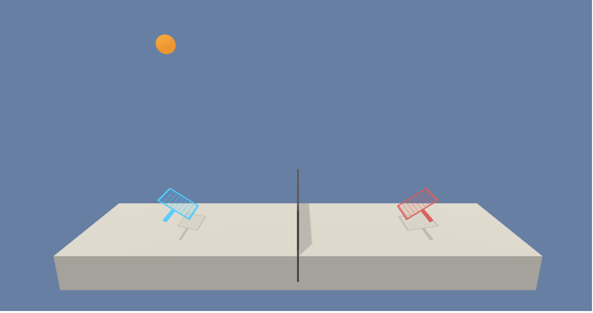

# Udacity reinforcement learning continuous control project

A solution to the third project of Udacities Reinforcement Learning course.

## **Project details**

This projects runs from Jupyter and has all of the code required in order to train and play back an agent.

### Goal
The goal of the project is to train an agent to control a racket to bounce the ball over the net.

### Rewards
You will receive a reward of +0.1 for bouncing the ball over the net. If the ball hits the ground or is hit out of bounds, a reward of -0.01 is rewarded.

### State
The state space consists of 8 variables that relates to the position and velocity of the ball and racket.

### Actions
Two actions are available that corresponds to the movement of the racket.

### Solved
This project is solved if the agent scores more than +0.5 points over 100 consecutive episodes.

## **Getting started**

You will need to install [Anaconda](https://www.anaconda.com) in order to run through the following dependency instructions.

All of the dependencies for this project can be found at: https://github.com/udacity/deep-reinforcement-learning#dependencies

## Instructions

Inside of the Jupyter notebook, run the first code block to import all the necessary libraries to run the rest of the code blocks.

The second code block loads the Unity environement and specifies the brain name.

The actor critic network is specified in the third block. This is a reference to the actor critic network used in the deep reinforcement learning for finance module.

Fourth code block is the Agent. The agent is used to determine the actions to take as well as interacts with the deep network to learn and better determine actions to increase environment rewards.

The training block runs through the specified episodes, receives the actions from the agent and passes it back to the environment.  It also saves the score and model if the score is more than what is specified in the checkpoint.
